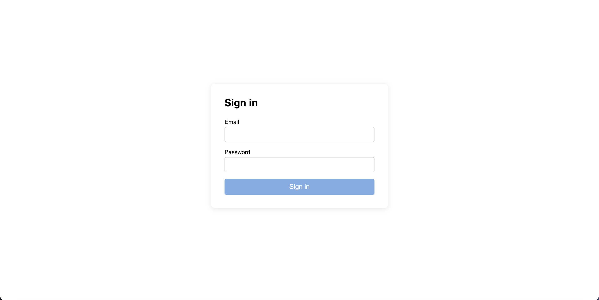
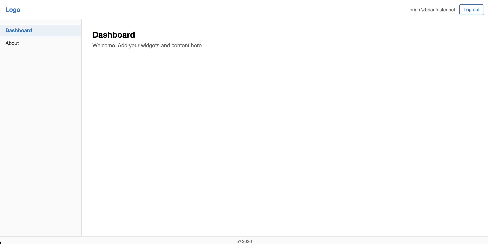

# AngularApp

This project was generated using [Angular CLI](https://github.com/angular/angular-cli) version 20.0.0. It includes a minimal business login template with **Supabase Auth** and a dashboard shell (fixed title bar, fixed sidebar on desktop, collapsible sidebar with hamburger on mobile).

## Screenshots

### Login



### Dashboard



## Quick start (use as template)

1. **Use this repo as a template** on GitHub (use "Use this template" → "Create a new repository") or clone it.
2. **Install and run:**
   ```bash
   nvm use   # or: nvm install  (use Node 20.19+ from .nvmrc before installing)
   npm install
   npm start
   ```
   The app builds and serves at `http://localhost:4200/`. Login will not work until you add Supabase credentials.
3. **Add Supabase credentials:** copy `.env.example` to `.env` and set `SUPABASE_URL` and `SUPABASE_ANON_KEY` (from [Supabase](https://supabase.com) → your project → **Settings → API**). Then run `npm start` again.

**Node:** Use Node 20.19+ before `npm install` (see `.nvmrc`; run `nvm use` or `nvm install`).

**To offer this as a template:** In your GitHub repo → **Settings** → check **Template repository**.

### Troubleshooting

- **Architecture mismatch errors** (`Cannot find module @rollup/rollup-darwin-arm64` or `@esbuild/darwin-arm64`): This happens when you install with one Node architecture and run with another (common with nvm + Rosetta on Mac). The build scripts auto-detect and fix this, but if it persists:
  ```bash
  npm run fix:native
  npm start
  ```
  Or do a clean install with the correct Node version:
  ```bash
  nvm use
  rm -rf node_modules && npm install
  npm start
  ```
- **`The Angular CLI requires a minimum Node.js version of v20.19`**: Run `nvm use` or `nvm install` so Node 20.19+ is active before `npm install` and `npm start`.

---

## Supabase setup

1. Create a project at [supabase.com](https://supabase.com) (or use an existing one).
2. In the dashboard: **Settings → API** — copy **Project URL** and the **anon public** key.
3. In **Authentication → Providers**, ensure **Email** is enabled.
4. Copy `.env.example` to `.env` and set `SUPABASE_URL` and `SUPABASE_ANON_KEY`.

`supabase.config.ts` is committed with blank values. It is **overwritten at build time** from `.env` (or from `SUPABASE_URL` / `SUPABASE_ANON_KEY`). Use `npm start` and `npm run build` so the generate step runs. Do not commit `.env`; it is in `.gitignore`. **Before committing:** run `npm run config:blank` to clear any generated credentials from `supabase.config.ts`, then `npm run check:pre-publish` to verify.

**Heroku:** Set `SUPABASE_URL` and `SUPABASE_ANON_KEY` in Config Vars. The build runs the generate script before `ng build`, so the app gets your credentials from the environment.

**Note:** The free tier may pause projects after 1 week of inactivity; you can restore from the Supabase dashboard.

## Development server

Run `npm start` (or `ng serve`). The generate script runs first and overwrites `supabase.config.ts` from `.env`. Open `http://localhost:4200/`; the app reloads when you change source files.

## Code scaffolding

Angular CLI includes powerful code scaffolding tools. To generate a new component, run:

```bash
ng generate component component-name
```

For a complete list of available schematics (such as `components`, `directives`, or `pipes`), run:

```bash
ng generate --help
```

## Building

Run `npm run build` (or `ng build`). The generate script runs first and overwrites `supabase.config.ts` from `.env` (or env vars). Output is in `dist/`.

## Running unit tests

To execute unit tests with the [Karma](https://karma-runner.github.io) test runner, use the following command:

```bash
ng test
```

## Running end-to-end tests

For end-to-end (e2e) testing, run:

```bash
ng e2e
```

Angular CLI does not come with an end-to-end testing framework by default. You can choose one that suits your needs.

## Additional Resources

For more information on using the Angular CLI, including detailed command references, visit the [Angular CLI Overview and Command Reference](https://angular.dev/tools/cli) page.
