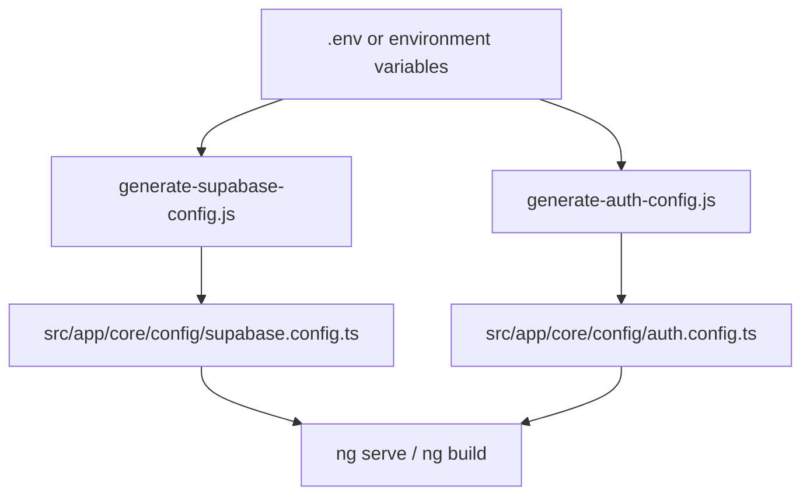

# AngularApp

Angular 20 SPA template with a responsive dashboard shell and **pluggable authentication**:

- **Supabase Auth**: email/password login
- **Okta**: embedded Okta Sign-In Widget (OIDC)

This repo is designed to be used as a template: you configure auth via `.env`, then `npm start` generates TypeScript config files at startup.

## Screenshots

### Login


### Dashboard


## Requirements

- Node **>= 20.19** (see `.nvmrc`)
- npm (ships with Node)

## 5-minute local start

```bash
nvm use   # or: nvm install
npm install
cp .env.example .env
npm start
```

Open `http://localhost:4200/`.

### Configure auth (required)

1. Open `.env`.
2. Set `AUTH_PROVIDER` to either `supabase` or `okta`.
3. Fill in the env vars for your chosen provider (see below).
4. Restart `npm start` if it was already running.

## Choose an auth provider

- Pick **Supabase** if you want the fastest setup (email/password) and you already have or can create a Supabase project.
- Pick **Okta** if you want an enterprise IdP-style login using the embedded Sign-In Widget.

You can switch providers at any time by changing `AUTH_PROVIDER` and restarting the dev server.

## Supabase setup (`AUTH_PROVIDER=supabase`)

1. Create a project at [supabase.com](https://supabase.com) (or use an existing one).
2. Supabase Dashboard → **Settings → API**:
   - Copy **Project URL** → `SUPABASE_URL`
   - Copy **anon public** key → `SUPABASE_ANON_KEY`
3. Supabase Dashboard → **Authentication → Providers**:
   - Ensure **Email** is enabled
4. Update `.env`:

```bash
AUTH_PROVIDER=supabase
SUPABASE_URL=https://your-project-id.supabase.co
SUPABASE_ANON_KEY=your_anon_key
```

## Okta setup (`AUTH_PROVIDER=okta`)

1. Create a free org: sign up for an **Okta Integrator Free Plan** at `https://developer.okta.com/signup/`.
2. Create an app integration:
   - Admin Console → **Applications → Applications → Create App Integration**
   - **Sign-in method**: OIDC - OpenID Connect
   - **Application type**: Single-Page Application
   - **Grant types**: enable **Refresh Token**, then under **Advanced** enable **Interaction Code**
   - **Sign-in redirect URI**: `http://localhost:4200/login/callback`
   - **Sign-out redirect URI**: `http://localhost:4200`
   - Assign users who should be able to sign in
3. Enable Interaction Code (if missing):
   - Admin Console → **Settings → Account → Embedded widget sign-in support**
   - Also ensure it’s enabled on the default authorization server rule:
     **Security → API → Authorization Servers → default → Default Policy Rule → IF Grant type is → Advanced → Interaction Code**
4. Add Trusted Origins:
   - Admin Console → **Security → API → Trusted Origins**
   - Add `http://localhost:4200` (enable CORS and Redirect as appropriate)
5. Update `.env`:

```bash
AUTH_PROVIDER=okta
OKTA_ISSUER=https://{yourOktaDomain}/oauth2/default
OKTA_CLIENT_ID={yourSpaClientId}
```

## How startup config works (important)

This repo **generates** TypeScript config files at startup/build time so you don’t have to commit secrets.

- `npm start` runs `prestart`
- `npm run build` runs `prebuild`

Those scripts (a) ensure native binaries match your Node architecture, and (b) generate config files from `.env` or environment variables.

Generated files (do not hand-edit; they are overwritten):

- `src/app/core/config/supabase.config.ts` (from `SUPABASE_URL` / `SUPABASE_ANON_KEY`)
- `src/app/core/config/auth.config.ts` (from `AUTH_PROVIDER` / `OKTA_*`)



## Useful commands

- `npm start`: dev server at `http://localhost:4200` (runs config generation first)
- `npm run build`: production build to `dist/` (runs config generation first)
- `npm test`: unit tests via Karma
- `npm run fix:native`: fix esbuild/Rollup architecture mismatch
- `npm run config:blank`: clear generated values from committed config files
- `npm run check:pre-publish`: verify no real credentials are present before pushing

## Troubleshooting

- **Angular CLI requires Node v20.19+**: run `nvm use` (or `nvm install`) before `npm install` / `npm start`.
- **Architecture mismatch** (`Cannot find module @rollup/rollup-darwin-arm64` / `@esbuild/darwin-arm64`): common when switching between Rosetta x64 and native arm64 Node on macOS.

  Try:

  ```bash
  npm run fix:native
  npm start
  ```

  Or a clean reinstall:

  ```bash
  nvm use
  rm -rf node_modules && npm install
  npm start
  ```

- **I changed `.env` but nothing happened**: stop and restart `npm start` (generation runs in `prestart`).
- **Login fails**: confirm you set the correct variables for your selected `AUTH_PROVIDER` in `.env`.

## Security / committing

- Do **not** commit `.env` (it’s ignored by git).
- Before committing, run:

```bash
npm run config:blank
npm run check:pre-publish
```

## Using this repo as a template

- GitHub: **Use this template** → **Create a new repository**
- (Optional) In your GitHub repo → **Settings** → enable **Template repository**
